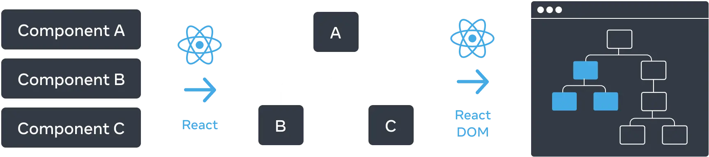
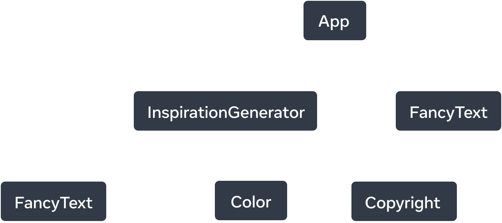
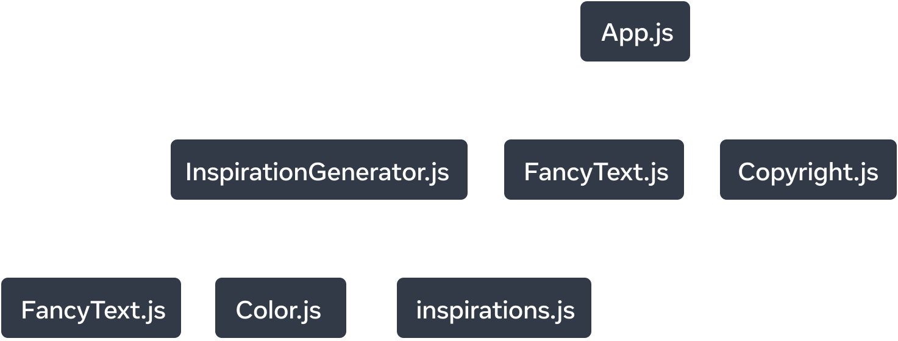
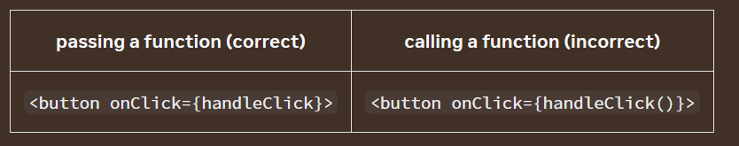

# React.js

## Intro:

React component is a JavaScript function that you can sprinkle with markup.
React components are regular JavaScript functions, but their names must start with a capital letter or they won’t work!


- React lets you create components, reusable UI elements for your app.

- In a React app, every piece of UI is a component.

- React components are regular JavaScript functions except:

  -  Their names always begin with a capital letter.
  -  They return JSX markup.
- A file can only have one default export, but it can have numerous named exports!

### JSX
- JSX attributes inside quotes are passed as strings.
- Curly braces let you bring JavaScript logic and variables into your markup.
- They work inside the JSX tag content or immediately after = in attributes.
- {{ and }} is not special syntax: it’s a JavaScript object tucked inside JSX curly braces.

### Props in React  
- **Props**: The default value is only used if the size prop is missing or if you pass size={undefined}. But if you pass size={null} or size={0}, the default value will not be used.
- To pass props, add them to the JSX, just like you would with HTML attributes.
- To read props, use the function Avatar({ person, size }) destructuring syntax.
- You can specify a default value like size = 100, which is used for missing and undefined props.
- You can forward all props with **<Avatar {...props} />** JSX spread syntax, but don’t overuse it!
- Nested JSX like <Card><Avatar /></Card> will appear as Card component’s children prop.
- Props are read-only snapshots in time: every render receives a new version of props.
- You can’t change props. When you need interactivity, you’ll need to set state.

### Conditional Rendering in React
- **Conditional Rendering**:  returning null from a component isn’t common because it might surprise a developer trying to render it. 
- if-else and ternary rendering is different any one them creat instances but due to react rerender property both are same

- Don’t put numbers on the left side of &&.

To test the condition, JavaScript converts the left side to a boolean automatically. However, if the left side is 0, then the whole expression gets that value (0), and React will happily render 0 rather than nothing.

For example, a common mistake is to write code like messageCount && <p>New messages</p>. It’s easy to assume that it renders nothing when messageCount is 0, but it really renders the 0 itself!

To fix it, make the left side a boolean: 
```jsx
messageCount > 0 && <p>New messages</p>.
```

### List and dict rendering
- Arrow functions containing => { are said to have a “block body”. They let you write more than a single line of code, but you have to write a return statement yourself. If you forget it, nothing gets returned!
- use map to render , use filter to filter
- The short <>...</> Fragment syntax won’t let you pass a key, so you need to either group them into a single <div>, or use the slightly longer and more explicit <Fragment> syntax:
- Note: 
```
You might be tempted to use an item’s index in the array as its key. In fact, that’s what React will use if you don’t specify a key at all. But the order in which you render items will change over time if an item is inserted, deleted, or if the array gets reordered. Index as a key often leads to subtle and confusing bugs.

Similarly, do not generate keys on the fly, e.g. with key={Math.random()}. This will cause keys to never match up between renders, leading to all your components and DOM being recreated every time. Not only is this slow, but it will also lose any user input inside the list items. Instead, use a stable ID based on the data.

Note that your components won’t receive key as a prop. It’s only used as a hint by React itself. If your component needs an ID, you have to pass it as a separate prop: <Profile key={id} userId={id} />.
``` 

### Importance of StrictMode
React offers a “Strict Mode” in which it calls each component’s function twice during development. By calling the component functions twice, Strict Mode helps find components that break these rules.

### function purity
```text
GOLDEN RULE
Ask THIS Question
❓ WHY should this code run?
If answer is:
👉 “Because USER did something”

Use:
event handler

If answer is:
👉 “Because component appeared/changed”

Use:
useEffect
```
## React as Tree


---

## Conditional Rendering



---
## Module Dependency



**Note**:
```text
As your app grows, often the bundle size does too. Large bundle sizes are expensive for a client to download and run. Large bundle sizes can delay the time for your UI to get drawn. Getting a sense of your app’s dependency tree may help with debugging these issues.
```


## interactivity
### steps: 

- You defined the handleClick function and then passed it as a prop to <button>. 
- handleClick is an event handler. Event handler functions:
  - Are usually defined inside your components.
  - Have names that start with handle, followed by the name of the event.
- By convention, it is common to name event handlers as handle followed by the event name. You’ll often see onClick={handleClick}, onMouseEnter={handleMouseEnter}, and so on.

**Alternatively**
you can define an event handler inline in the JSX:

```jsx
<button onClick={function handleClick() {
  alert('You clicked me!');
}}>

Or, more concisely, using an arrow function:

<button onClick={() => {
  alert('You clicked me!');
}}>
```
- All of these styles are equivalent. Inline event handlers are convenient for short functions.
### mistakes in event handler



### Event Bubbling in React
Event handlers will also catch events from any children your component might have. We say that an event “bubbles” or “propagates” up the tree: it starts with where the event happened, and then goes up the tree.

- to stop this propagation
```jsx
 <button onClick={e => {
      e.stopPropagation();
      onClick();
    }}>
      {children}
 </button>
```

### event handler phases
- capturephase which is used to track the events from top to down
```jsx
<div onClickCapture={() => { /* this runs first */ }}>
  <button onClick={e => e.stopPropagation()} />
  <button onClick={e => e.stopPropagation()} />
</div>
```
- Propagration phase which is cause error so we will stop it
```jsx
 <button onClick={e => {
      e.stopPropagation();
      onClick();
    }}>
      {children}
 </button>
```

**NOTE:**
```
Don’t confuse e.stopPropagation() and e.preventDefault(). They are both useful, but are unrelated:

    e.stopPropagation() stops the event handlers attached to the tags above from firing.
    e.preventDefault() prevents the default browser behavior for the few events that have it.
```

## why changing variable even using pure function, wont appear in component 


### State is isolated
if you render the same component twice, each copy will have completely isolated state! Changing one of them will not affect the other.

- **Important Catch:**
A state variable is only necessary to keep information between re-renders of a component. Within a single event handler, a regular variable will do fine. Don’t introduce state variables when a regular variable works well.
- example
```jsx
export default function FeedbackForm() {
  function handleClick() {
    const name = prompt('What is your name?');
    alert(`Hello, ${name}!`);
  }

  return (
    <button onClick={handleClick}>
      Greet
    </button>
  );
}
```

## React Rendering steps
- Any screen update in a React app happens in three steps:
  -  Trigger (create component and call render method to target node of DOM)
  -  Render (render the components if any child change the state they also renders)
  -  Commit (React only changes the DOM nodes if there’s a difference between renders. no other than change will render)
- You can use Strict Mode to find mistakes in your components
- React does not touch the DOM if the rendering result is the same as last time

## React Queueing a Series of State Updates


## Updating Object State
**important**:
- Treat all state in React as immutable.
- When you store objects in state, mutating them will not trigger renders and will change the state in previous render “snapshots”.
- Instead of mutating an object, create a new version of it, and trigger a re-render by setting state to it.
- You can use the {...obj, something: 'newValue'} object spread syntax to create copies of objects.

```jsx
setPerson({
  firstName: e.target.value, // New first name from the input
  lastName: person.lastName,
  email: person.email
});
```
is equal to 
```jsx
setPerson({
  ...person, // Copy the old fields
  firstName: e.target.value // But override this one
});
```
---
### In Forms 
```jsx

export default function Form() {
  const [person, setPerson] = useState({
    firstName: 'Barbara',
    lastName: 'Hepworth',
    email: 'bhepworth@sculpture.com'
  });

  function handleChange(e) {
    setPerson({
      ...person,
      [e.target.name]: e.target.value
    });
  }
}
```
is equal to 

```jsx
const [person, setPerson] = useState({
    firstName: 'Barbara',
    lastName: 'Hepworth',
    email: 'bhepworth@sculpture.com'
  });

  function handleFirstNameChange(e) {
    setPerson({
      ...person,
      firstName: e.target.value
    });
  }

  function handleLastNameChange(e) {
    setPerson({
      ...person,
      lastName: e.target.value
    });
  }

  function handleEmailChange(e) {
    setPerson({
      ...person,
      email: e.target.value
    });
  }

```

---

### Nested Objects 
“nesting” is an inaccurate way to think about how objects behave. When the code executes, there is no such thing as a “nested” object. You are really looking at two different objects:
```jsx
let obj1 = {
  title: 'Blue Nana',
  city: 'Hamburg',
  image: 'https://react.dev/images/docs/scientists/Sd1AgUOm.jpg',
};

let obj2 = {
  name: 'Niki de Saint Phalle',
  artwork: obj1
};
```
then the mutation of nested object will be :
```jsx
const nextArtwork = { ...person.artwork, city: 'New Delhi' };
const nextPerson = { ...person, artwork: nextArtwork };
setPerson(nextPerson);
```
Or, written as a single function call:
```jsx
setPerson({
  ...person, // Copy other fields
  artwork: { // but replace the artwork
    ...person.artwork, // with the same one
    city: 'New Delhi' // but in New Delhi!
  }
});
```
---

- if it is difficult to work with nested Object . we can use immer library which will make life easier with nested object just like with js
```jsx

import { useImmer } from 'use-immer';

export default function Form() {
  const [person, updatePerson] = useImmer({
    name: 'Niki de Saint Phalle',
    artwork: {
      title: 'Blue Nana',
      city: 'Hamburg',
      image: 'https://react.dev/images/docs/scientists/Sd1AgUOm.jpg',
    }
  });

// just like how we work with normal js
  function handleNameChange(e) {
    updatePerson(draft => {
      draft.name = e.target.value;
    });
  }
}
```

## Updating Arrays state


- Instead of mutating an array, create a new version of it, and update the state to it.
- You can use the [...arr, newItem] array spread syntax to create arrays with new items.
- You can use filter() and map() to create new arrays with filtered or transformed items.
- You can use Immer to keep your code concise.

## Managing the state
- Declarative programming focuses on what the desired result is, while imperative programming focuses on how to achieve that result through step-by-step instructions
- Declarative programming means describing the UI for each visual state rather than micromanaging the UI (imperative).
- When developing a component:

  - Identify all its visual states.
  - Determine the human and computer triggers for state changes.
  - Model the state with useState.
  - Remove non-essential state to avoid bugs and paradoxes.
  - Connect the event handlers to set state.
---

## Core Principles of State Structure

### 1. Group Related State
If multiple state variables always update together, combine them into a single state object.

```js
const [position, setPosition] = useState({
  x: 0,
  y: 0
});
```

### 2. Avoid Contradictory State
Do not create multiple state variables that can conflict with each other.

❌ Bad:
```js
const [isSending, setIsSending] = useState(false);
const [isSent, setIsSent] = useState(false);
```

✅ Better:
```js
const [status, setStatus] = useState("typing");
```

---

### 3. Avoid Redundant State
If a value can be derived from existing state or props, do not store it separately.

❌ Bad:
```js
const [fullName, setFullName] = useState("");
```

✅ Better:
```js
const fullName = firstName + " " + lastName;
```

---

### 4. Avoid Duplicate State
Do not store the same object in multiple places.

❌ Bad:
```js
const [selectedItem, setSelectedItem] = useState(item);
```

✅ Better:
```js
const [selectedId, setSelectedId] = useState(item.id);
```

---

### 5. Avoid Deeply Nested State
Deep nested structures are difficult to update.

✅ Prefer normalized/flat structures:
```js
{
  1: { id: 1, title: "React" },
  2: { id: 2, title: "Node.js" }
}
```

## State Lifting
- When you want to coordinate two components, move their state to their common parent.
- Then pass the information down through props from their common parent.
- Finally, pass the event handlers down so that the children can change the parent’s state

## Preserving state or resetting state
- React keeps state for as long as the same component is rendered at the same position.
- State is not kept in JSX tags. It’s associated with the tree position in which you put that JSX.
- You can force a subtree to reset its state by giving it a different key.
- Don’t nest component definitions, or you’ll reset state by accident

For more: <a href="https://react.dev/learn/preserving-and-resetting-state">Preserving and Resetting State</a>

## Extract state logic to specific file
### Steps:

1. Move from setting state to dispatching actions.
```jsx

function handleAddTask(text) {
  setTasks([
    ...tasks,
    {
      id: nextId++,
      text: text,
      done: false,
    },
  ]);
}
```
to 
```jsx
function handleAddTask(text) {
  dispatch({
    type: 'added', //action in form of happened
    id: nextId++, //payload
    text: text, //payload
  });
}
```
2. Write a reducer function.
```jsx
function tasksReducer(tasks, action) {
  switch (action.type) {
    case 'added': {
      return [
        ...tasks,
        {
          id: action.id,
          text: action.text,
          done: false,
        },
      ];
    }
    case 'changed': {
      return tasks.map((t) => {
        if (t.id === action.task.id) {
          return action.task;
        } else {
          return t;
        }
      });
    }
    case 'deleted': {
      return tasks.filter((t) => t.id !== action.id);
    }
    default: {
      throw Error('Unknown action: ' + action.type);
    }
  }
}
```
3. Use the reducer from your component.
```jsx
const [tasks, dispatch] = useReducer(tasksReducer, initialTasks);
//    [payload, function]           (reducer function, initial state)
```

### Rules:
- Reducers require you to write a bit more code, but they help with debugging and testing.
- Reducers must be pure.
- Each action describes a single user interaction.
- Use Immer if you want to write reducers in a mutating style.
```text
useImmerReducer lets you mutate the state with push or arr[i] = assignment:
```

## passing data direct to child deeply with context
- Context lets a component provide some information to the entire tree below it.
- To pass context:

  -  Create and export it with export const MyContext = createContext(defaultValue).
  -  Pass it to the useContext(MyContext) Hook to read it in any child component, no matter how deep.
  -  Wrap children into <MyContext value={...}> to provide it from a parent.

- Before you use context, try passing props or passing JSX as children.


## Scaling Up with Reducer and Context 
- You can combine reducer with context to let any component read and update state above it.
- To provide state and the dispatch function to components below:
    - Create two contexts (for state and for dispatch functions).
    - Provide both contexts from the component that uses the reducer.
    - Use either context from components that need to read them.
- You can export a component like TasksProvider that provides context.

# Escape hatch
## Referencing Values with Refs
### When to use refs

- Typically, you will use a ref when your component needs to “step outside” React and communicate with external APIs—often a browser API that won’t impact the appearance of the component. Here are a few of these rare situations:

  -  Storing timeout IDs
  -  Storing and manipulating DOM elements, which we cover on the next page
  -  Storing other objects that aren’t necessary to calculate the JSX.

- If your component needs to store some value, but it doesn’t impact the rendering logic, choose refs.

### Best practices for refs

- Following these principles will make your components more predictable:

  -  Treat refs as an escape hatch. Refs are useful when you work with external systems or browser APIs. If much of your application logic and data flow relies on refs, you might want to rethink your approach.
  -  Don’t read or write ref.current during rendering. If some information is needed during rendering, use state instead. Since React doesn’t know when ref.current changes, even reading it while rendering makes your component’s behavior difficult to predict. (The only exception to this is code like if (!ref.current) ref.current = new Thing() which only sets the ref once during the first render.)

**Example:** stop watch


---

### Why do multiple JSX tags need to be wrapped?

JSX looks like HTML, but under the hood it is transformed into plain JavaScript objects. You can’t return two objects from a function without wrapping them into an array. This explains why you also can’t return two JSX tags without wrapping them into another tag or a Fragment.


## Thinking as React

- **separation of concern(in react components)**: each component should have a single responsibility and should not be concerned with other components
- **list then in hierrarchy**: list the components and then organize them in a hierarchy
- **Static version of product**: create a static version of the product first with props and without state, then add interactivity using state
- **Adding interactivty**: identify the state that changes the UI and add interactivity using state hook
- **Identify which component owns states**: identify which component owns the state and pass it down as props to child components
    - keep state in closest common parent or make state only component as parent

## important note on installation of Reactjs

- create react app (scratch react installation) is deprecated
- react offically recommends to use react framworks like: Nextjs, expro etc
- or to use build tools like vite , parcel or RSBuild

## Limitations

- Routing is not included in react, so we need to use a router library like react-router
- data Fetching : data is fetched after the render of ui using useEffect hook . but for the sake of ux we should fetch before ui render . hence libraries like TanStack Query or swr , applo , relay are used

## Build file size using create-react-app
```terminal
 173.58 kB  build\static\js\main.11a423f3.js
  1.77 kB    build\static\js\453.6be02b40.chunk.js
  263 B      build\static\css\main.e6c13ad2.css   
```

## when routing
```terminal
  154.46 kB  build\static\js\main.bbc17c48.js
  1.77 kB    build\static\js\453.6be02b40.chunk.js
  263 B      build\static\css\main.e6c13ad2.css 
```
## when code lazy loaded 
```terminal
  93.83 kB  build\static\js\867.d345f48c.chunk.js
  61.17 kB  build\static\js\main.61f62370.js
  1.77 kB   build\static\js\453.6be02b40.chunk.js      
  284 B     build\static\js\260.d32b4614.chunk.js      
  263 B     build\static\css\main.e6c13ad2.css
  232 B     build\static\js\541.21c2c43c.chunk.js  
```
## using router library
```terminal
93.83 kB  build\static\js\867.d345f48c.chunk.js
  91.42 kB  build\static\js\main.6dd3413b.js
  1.77 kB   build\static\js\453.6be02b40.chunk.js      
  280 B     build\static\js\260.0c505523.chunk.js      
  263 B     build\static\css\main.e6c13ad2.css
  227 B     build\static\js\541.41e243cd.chunk.js
```

| Approach      | Problem       |
| ------------- | ------------- |
| Static import | Huge bundle ❌ |
| React.lazy    | Waterfall ❌   |
| Prefetch      | Smooth UX ✅   |


## compare 
| Feature            | Code Splitting | Prefetch | Routing | Vite |
| ------------------ | -------------- | -------- | ------- | ---- |
| Splits bundle      | ✅              | ❌        | ✅       | ✅    |
| Controls timing    | ❌              | ✅        | ✅       | ❌    |
| Prevents waterfall | ❌              | ✅        | ✅       | ❌    |
| Automatic          | ❌              | ❌        | ✅       | ✅    |
| Dev speed          | ❌              | ❌        | ❌       | ✅    |

### so combine all 
- Code split at route level
- Use router lazy loading
- Add prefetch for important paths
- Use Vite for better bundling


## Server Rendering is not just for SEO

A common misunderstanding is that server rendering is only for SEO.

While server rendering can improve SEO, it also improves performance by reducing the amount of JavaScript the user needs to download and parse before they can see the content on the screen.

This is why the Chrome team has encouraged developers to consider static or server-side render over a full client-side approach to achieve the best possible performance.
---
## Build file size using vite without code split
```terminal
ite v8.0.10 building client environment for production...
✓ 18 modules transformed.
computing gzip size...
dist/index.html                   0.46 kB │ gzip:  0.30 kB
dist/assets/index-nqMpL4T3.css    1.78 kB │ gzip:  0.81 kB
dist/assets/index--D8uq3HV.js   191.31 kB │ gzip: 60.33 kB

✓ built in 409ms
```

## Build file size using vite with code split
```terminal
dist/index.html                      0.46 kB │ gzip:  0.30 kB
dist/assets/index-nqMpL4T3.css       1.78 kB │ gzip:  0.81 kB
dist/assets/Home-DrT-hBcn.js         0.11 kB │ gzip:  0.13 kB
dist/assets/Dashboard-Z8QZxVMr.js    0.12 kB │ gzip:  0.13 kB
dist/assets/index-BTqh4v9_.js      192.63 kB │ gzip: 60.89 kB

✓ built in 173ms
```
## Build file size using vite with code split and prefetch using react-router-dom
```terminal
✓ 26 modules transformed.
computing gzip size...
dist/index.html                      0.46 kB │ gzip:  0.30 kB
dist/assets/index-nqMpL4T3.css       1.78 kB │ gzip:  0.81 kB
dist/assets/Dashboard-ZyKJ-bR9.js    0.17 kB │ gzip:  0.16 kB
dist/assets/Home-BSJCeCUk.js         0.18 kB │ gzip:  0.16 kB
dist/assets/index-DyysMvgV.js      283.98 kB │ gzip: 90.34 kB

✓ built in 225ms
```
- **Solution for large buildler**: internally uses webpack and babel to bundle the code.

### Benifits: 
Splitting code by route, when integrated with bundling and data fetching, can reduce the initial load time of your app and the time it takes for the largest visible content of the app to render (Largest Contentful Paint).

## React Features
- automatically memoization using React compiler 
```
note - memo breaks.
Exactly what React docs mention: memo becomes useless if props are “always new.” 
```

- **debugging**: If the bug still occurs when all memoization is removed, you have a Rules of React violation that needs to be fixed